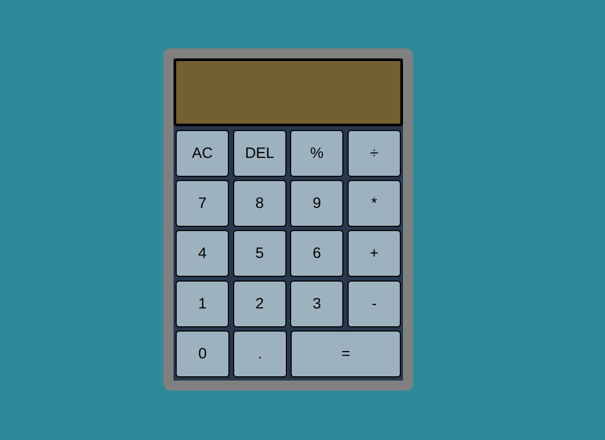

<!-- PROJECT LOGO -->

    

<h3 align="center">Calculator</h3>

  

    Let's perform arithmetic operations on numbers
     
     
    <a href="https://technmad.github.io/Calculator/" target="_blank">View Demo</a>
    ·
    <a href="https://technmad.github.io/Calculator/issues" target="_blank">Report Bug</a>
    ·
    <a href="https://technmad.github.io/Calculator/issues" target="_blank">Request Feature</a>
  

 

<!-- ABOUT THE PROJECT -->
## Preview

 

## Features

- A Simple Calculator which is built with Modern Javascript practices  
- It can evaluate expressions for Multiplication, Division, Subraction, Addition & Modulo Division 
- Comes with user friendly UI & UX
- Responsive for both Desktop & Mobile

 

## Outcome

* Used HTML5 **semantic elements** for better readability and structure
* Used CSS3 **grid** and **flex** to manage layout
* Used **Data-Attributes** for accessing DOM Elements
* Used **Git** and **GitHub** for project management
* Tried to maintain **clean code**
* **Cross tested** on Firefox and Chromium based browsers

 

## What I learned

* Usability of Javascript's **ES6 Classes**
* Deepened knowledge of how **functions** work together
* Learned to add **keyboard support** with event listeners
* A lot of minor things

 

### Built With

-    
-    
- 

 

### Tools Used

-    
-   
-   

 

<!-- ACKNOWLEDGMENTS -->
## Acknowledgments

* Inspiration by [The Odin Project](https://www.theodinproject.com/)

 

<!-- LICENSE -->
## License

- Distributed under the MIT License. See `LICENSE.txt` for more information.

 

<!-- CONTACT -->
## Author

&nbsp;&nbsp;&nbsp;
 &nbsp;&nbsp;&nbsp;
<!--  -->

 
